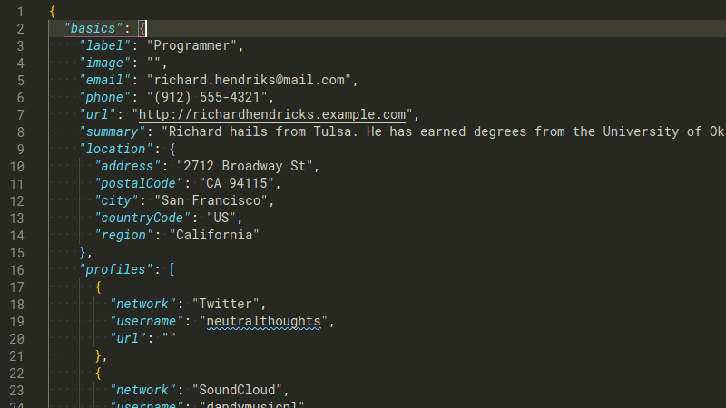
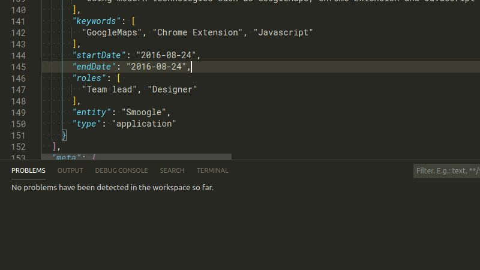

# JSONResume

This extension provides Intellisense, and validation support for JSON Resume files.

## Features

To use this plugin, open a JSON Resume file named either `resume.json` or with a name ending in `.resume.json`.

### Intellisense

To activate Intellisense, press CTRL + SPACE where you want to enter a new field.

### Validation

Validation is automatic. To see issues with your resume, open the `Problems` tab.

